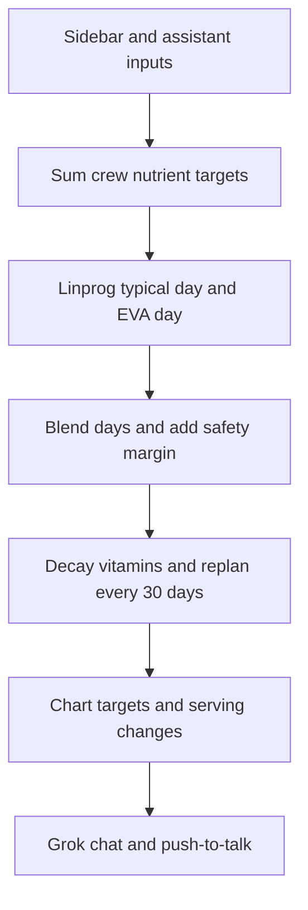

# Mission Pantry

Minimum-mass ISS pantry planner that replans the menu as vitamins decay, with a Grok voice assistant.

## The problem

A long mission launches with a fixed food supply. Vitamins in that food decay over time, so a menu that meets targets on day 0 can miss them months later.

## What it does

Sidebar inputs are mission length, crew (age, sex, weight, height, allergies; 1–6 people), EVA hours per week, and a safety margin (default 10%). Defaults are 30 days, one male crewmember (age 45, 82.9 kg, 180 cm, no allergies), and 6.5 EVA hours per week. Resupply delay is shown in the sidebar. The assistant tool `delay_resupply` adds days. Packed horizon is mission days plus that delay. Storage age on mission day `t` is `t` plus the delay.

`mission.mission_food` solves two days with `optimizer.optimize_menu` (`scipy.optimize.linprog`): a typical day with no EVA, and an EVA day. The objective is packaged mass. Constraints are nutrient minimums, upper limits, a sodium cap (the tighter of the summed upper limit and 2,300 mg per person), at most 2 servings per person per day, and allergy exclusion (a food is dropped when its name contains an allergen of at least 3 characters). Energy may sit above the estimated requirement; the solver does not force that target as an equality. Weekly EVA hours become an EVA-day fraction, which is always passed in. Servings from the two days are blended by that fraction and scaled by `1 + safety_margin`. The packing list is heaviest first.

`decay.replan_mission` decays vitamins with `C(t) = C0 * exp(-k_per_year * t_days / 365.25)` and re-solves the menu every 30 days. Charts plot each vitamin against its target for the locked day-0 menu and the replanned menu, highlight days the locked menu would miss a vitamin, and list serving changes at each replan. The safety margin stays on the packing list and is not applied again inside those daily solves.

The Grok assistant tools call those functions: `set_mission_length`, `add_crew`, `remove_crew`, `add_eva_hours`, `delay_resupply`, and `nutrient_shortfalls`. After a change it re-runs the optimizer and summarizes mass and packing-list diffs. Voice is push-to-talk: speech-to-text `grok-voice-transcribe-2.0`, chat tools `grok-4.7`, text-to-speech voice `eve`. The browser never sees the key.

## How it works



Crew age, sex, weight, and height set energy and micronutrient targets. The linear program packs a minimum-mass typical day and an EVA day from the ISS menu. Those days are blended by the EVA-hour schedule, then the same menu is decayed and re-solved every 30 days. The assistant changes the inputs through tools and reads the new mass, packing diff, and shortfalls.

## Data sources

Column notes live in [data/README.md](data/README.md). Shipped tables:

- `iss_menu.csv` — NASA STEMonstrations Nutrition, Appendix A: https://www.nasa.gov/wp-content/uploads/2023/03/stemonstrations-nutrition.pdf
- `micronutrient_requirements.csv` — NASEM DRI Appendix J (2019): https://www.nationalacademies.org/read/25353/chapter/28 and NASA HIDH Rev 1: https://www.nasa.gov/wp-content/uploads/2023/03/human-integration-design-handbook-revision-1.pdf
- `energy_rules.json` — NASA-STD-3001 Vol 2 Rev E: https://ntrs.nasa.gov/api/citations/20250004555/downloads/NASA-STD-3001%20Vol%202%20Rev%20E%20FINAL_05022025.pdf , OCHMO-TB-013: https://www.nasa.gov/wp-content/uploads/2023/12/ochmo-tb-013-food-and-nutrition.pdf , and NASEM AMDR: https://www.nationalacademies.org/read/27957/chapter/5
- `usda_vitamins.csv` — USDA FoodData Central bulk downloads: https://fdc.nal.usda.gov/download-datasets
- `shelf_life_decay.csv` — Cooper, Douglas, and Perchonok 2017, npj Microgravity: https://www.nature.com/articles/s41526-017-0022-z ; NASA Hurdle Approach 2022: https://ntrs.nasa.gov/api/citations/20220001872/downloads/Hurdle%20Approach_2022_FINAL_%20No%20audio.pdf ; Food Fortification Stability Study: https://ntrs.nasa.gov/citations/20160001048

[data/README.md](data/README.md) also describes a Launch Library 2 v2.3.0 cache (`https://ll.thespacedevs.com/2.3.0/...`): `spacewalks.json`, `docking_events.json`, `expeditions.json`, and `upcoming_launches.json`. That cache is not in this tree. The EVA fraction can be passed in when `data/launch_library/spacewalks.json` is absent; the app does that from the sidebar EVA hours.

## What's real vs simulated

| Simulated | Real |
| --- | --- |
| Inventory and crew profiles | Menu, nutrition standards, decay research, spacewalks and launches |

## Setup

Python 3. `requirements.txt` pins `pandas==3.0.6`, `scipy==1.18.1`, `streamlit==1.65.0`, and `pytest==9.1.1`.

```bash
pip install -r requirements.txt
streamlit run app.py --server.port 8765
```

Optional: copy `.env.example` to `.env` and set `XAI_API_KEY`, or set `xai_api_key` in `.streamlit/secrets.toml`. Precedence is the process environment `XAI_API_KEY`, then the repo `.env`, then `.streamlit/secrets.toml`. Without a key, chat and voice stay disabled. The manifest, packing list, and decay charts still run.

`python data_loader.py` prints row counts and missing values for the food tables.

## Tech stack

Python, Streamlit, SciPy, Grok API, Cursor.

## Screenshots

Screenshots go here.

<!-- docs/screenshots/manifest.png -->
